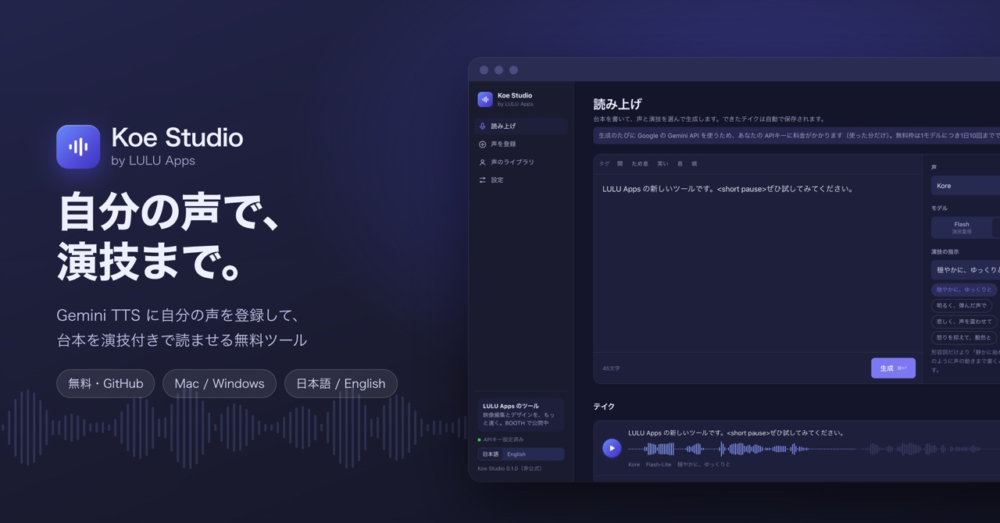
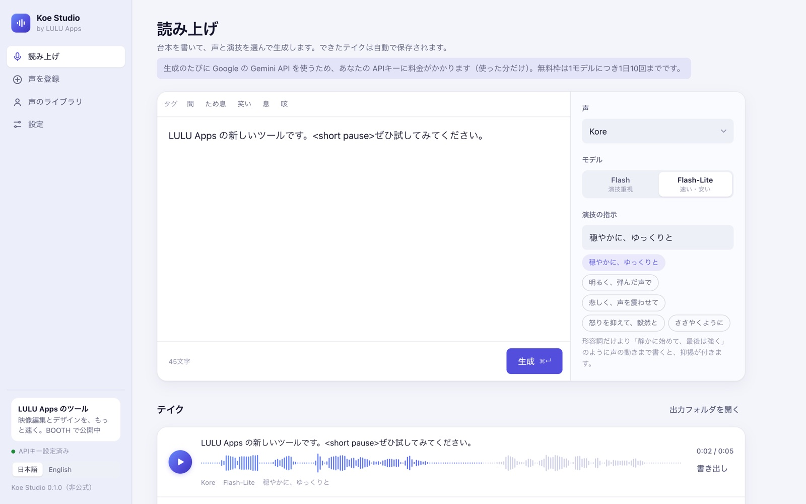

# Koe Studio

English ・ [日本語](README.md)

A small, free app for **registering your own voice with Gemini TTS and having it read your scripts with direction**.
It runs on your computer and you use it in the browser. Works on Mac and Windows. The interface is available in English and Japanese.

- Register your own voice (Google's Voice Replication)
- Direct the delivery ("bright and bouncy", "sad, with a trembling voice") and insert tags for pauses, sighs, and laughs
- Every take is saved automatically as a WAV file in the `出力` (output) folder
- Google's 30 stock voices are available too

> **This app uses Google's Gemini API.** Registering a voice and generating audio are billed by Google to your API key every time you use them (pay as you go; the free tier allows 10 requests per model per day). It is not an unlimited free service.
>
> Unofficial tool, not affiliated with Google.

## Requirements

- A Mac (macOS) or Windows computer
- A Google account and a Gemini **API key** (free to create)
- An internet connection

You don't need to install Python yourself. On first launch, the app asks whether to install `uv`, the tool it needs to run.

## Getting started

1. On this page, click the green **Code** button → **Download ZIP**, then unzip it.
2. Launch it:
   - **Mac**: double-click `起動（Mac）.command`
   - **Windows**: double-click `起動（Windows）.bat`
3. The app opens in your browser. Create a key on the [API keys page in Google AI Studio](https://aistudio.google.com/apikey), paste it, and click **Save and start**.
   The key is stored in your computer's secure storage (Keychain on Mac, Credential Manager on Windows).

To quit, press `Ctrl + C` in the terminal window that opened at launch.

### If the app won't open

- **Mac: "cannot be opened because the developer cannot be verified"**: right-click `起動（Mac）.command` → **Open** → **Open**. If that doesn't work, go to System Settings → Privacy & Security and click **Open Anyway**.
- **Windows: "Windows protected your PC"**: click **More info** → **Run anyway**.
- **Mac asks for Keychain access**: this is to read your saved key. Enter your password and choose **Always Allow**.

## If it won't launch: browser version (fallback)

If the launchers (`.command` / `.bat`) don't work — for example you can't install `uv`, or your work computer is locked down —
**just double-click `index.html` (or drag it into a browser window)**.
In this mode the page calls the Gemini API directly from your browser, without the local server.

| | Standard (launcher) | Browser version (open `index.html` directly) |
|---|---|---|
| Requirements | `uv` (offered on first launch) | Just a browser |
| Where the API key is kept | Keychain on Mac, Credential Manager on Windows | Only in that tab. Saved to the browser only if you choose "Remember the key in this browser" |
| Generated audio | Saved automatically to the `出力` folder | Not saved automatically. Use "Export" on each take |
| Pricing | Gemini API (your API key) | Same |

- The sidebar shows "Browser version (fallback)".
- Don't remember the key on a shared computer. The key is sent only from your browser to Google.
- Tested with Google Chrome.

## Registering your voice

In **Add voice**, add two recordings. Record both **with the same person, in the same room, with the same microphone**.

1. **Sample**: 10–30 seconds of natural speech. Talking as if to someone sounds more expressive than reading.
2. **Consent**: read this statement exactly:
   > I am the owner of this voice and I consent to Google using this voice to create a synthetic voice model.

**Use the recordings as they are — don't convert or edit them.** An m4a recorded with QuickTime Player (File → New Audio Recording) works as is.
Recordings converted to WAV, or voices made with voice changers, can be flagged as synthetic by Google's safety check and rejected.

Registered voices are kept by Google for one year (up to 200 per project).

## Pricing and the free tier (as of September 2026)

| | Free tier | Paid tier (pay as you go) |
|---|---|---|
| Price | Free | Flash: $9 per 1M audio tokens, Flash-Lite: $6 (about double from January 2027) |
| Limits | 10 requests per model per day | Much higher |
| Your recordings and scripts | May be used to improve Google's products and reviewed by people | Not used to improve products |

A few seconds of audio costs well under a cent. **If you register your own voice, we recommend the paid tier** (enable billing in AI Studio).
Check current prices on the [Gemini API pricing page](https://ai.google.dev/gemini-api/docs/pricing).

In the EU, UK, and Switzerland, Google's terms require the paid tier.

## Don't

- Register or use someone else's voice without their consent
- Impersonate anyone or create misleading or fraudulent audio
- Use it against the [Gemini API Terms of Service](https://ai.google.dev/gemini-api/terms) or Google's prohibited use policies

## Troubleshooting

| Message | What to do |
|---|---|
| The launcher doesn't work | Open `index.html` directly and use the browser version (fallback) |
| The API key is not valid | Copy the key again in AI Studio, then Settings → Replace key |
| Rate limit reached (429) | You hit the free tier's 10 requests per day. Wait until tomorrow or switch to the paid tier |
| Judged to contain synthetic speech | Use the original, unconverted recording |
| The safety check failed | Re-record the sample and consent with the same person, room, and microphone |
| Prepaid balance and credits are 0 (402) | Check Billing in AI Studio |

The full error text appears in the terminal window that opened at launch.

## How it works (for developers)

- `app.py`: a small Python server (`google-genai`, `keyring`). It listens only on `127.0.0.1` and requires a per-launch token.
- `index.html`: the interface. It loads no external sites or fonts.
- Models: `gemini-3.8-flash-tts` (best acting) / `gemini-3.8-flash-lite-tts` (faster, cheaper).
- If the `GEMINI_API_KEY` environment variable is set, it takes priority over the saved key.
- Run from a terminal: `uv run app.py` (add `--no-browser` to skip opening the browser).

Gemini's features and prices may change. This tool works with the API as of when it was made, with no warranty.

## Author

**LULU Apps** — Faster video editing and design.
We make assets and tools for Premiere Pro, Photoshop, and Illustrator.

- BOOTH: https://luluapps.booth.pm/

## License

MIT License ([LICENSE](LICENSE)).
